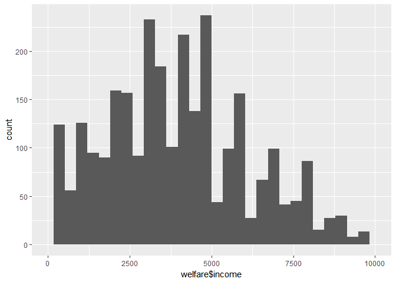
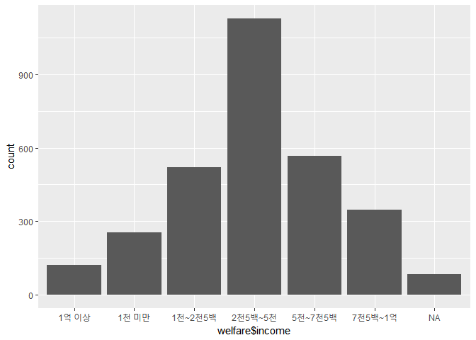

소득분위별 사회적 지원체계의 차이
================

1. 요약(초록)
-------------

소득분위별로 사회적 지원체계로 볼 수 있는 걱정거리 상의대상과 경제적 도움을 주는 대상에 차이가 있는지 분석해보았다. 그 결과 소득의 낮을수록 걱정거리를 상의할 대상이 없는 비율이 높게 나와 소득이 낮은 사람에게 사회적 지원체계도 부족하다는 분석을 할 수 있다. 또한 경제적 도움을 줄 수 있는 여러 사회적 지원대상 중 정부의 비율이 미미하게 나왔다. 이를 정부가 실시하고 있는 복지서비스 사업에 대한 인지여부와 연결지어 분석한 결과 정부사업에 대한 인지율이 적은 수치로 나타났다.

2. 분석 주제
------------

본 보고서는 서울복지실태조사 데이터를 통해 소득분위별 사회적 지원체계의 차이에 대한 분석을 하고자 한다.

3. 데이터 선정
--------------

#### 데이터: 2015년 서울복지실태조사

#### 데이터 소개(출처, 다운로드 URL, 특성, 구성)

-   출처 : 서울연구데이터서비스 \[<http://data.si.re.kr/sisurvey2015er17>\]

-   특성 : 본 데이터는 서울특별시와 서울연구원이 주관하여 조사한 자료이며, 서울시민의 생활실태와 복지 욕구 변화 추적을 위한 데이터 구축과 서울시 복지 정책 수립 및 집행성과 모니터링을 위한 근거 자료 수집을 위해 조사한 것이다.

-   구성 : 2015년 서울특별시에 거주하는 3019가구를 대상으로 조사하였으며 주로 경제활동, 건강과 의료이용, 가족생활과 여가 및 사회활동, 복지서비스 이용, 복지의식 및 욕구에 관한 변수로 구성되어 있다.

4. 분석: 코드, 표, 그래프, 결과 해석
------------------------------------

### 1) 분석목적 및 방법

소득분위별 사회적 지원체계의 차이가 있는지 알아보고 차이가 있다면, 어떤 영향으로 인해 차이가 발생하는지 알아보고자 한다. 분석 방법은 1차적으로 소득수준에 따라 집단을 구성한 후, 주로 도움을 받는 사회적 지원체계의 항목별 비율을 구한다. 1차분석을 통해 높은비율 혹은 낮은비율을 차지한 항목을 분석하고 다른 변수와 연결지어서 왜 항목별 비율이 차이가 나는지 2차분석한다.

### 2) 변수 검토 및 전처리

#### 패키지 로드하기

``` r
library(ggplot2)
library(dplyr)
library(readxl)
library(tidyr)
```

#### 데이터 불러오기

복사본을 만들어 분석에 활용

``` r
welfare_data <- read_excel("welfare_data.xlsx")
welfare <- welfare_data
```

#### 필요한 변수 정제하기

*소득변수*

소득과 관련된 변수의 이름 변경

``` r
welfare <- rename(welfare, income=B10_Total)
```

코드북을 보면 999999로 표기되어 있는 데이터는 모름또는 무응답이기 때문에 결측치로 처리한 후 확인

``` r
welfare$income <- ifelse(welfare$income==999999, NA, welfare$income)
table(is.na(welfare$income))
```

    ## 
    ## FALSE  TRUE 
    ##  2936    83

일정한 기준에 따라 소득변수의 범주를 설정하기 위해 소득변수를 검토

``` r
summary(welfare$income)
```

    ##    Min. 1st Qu.  Median    Mean 3rd Qu.    Max.    NA's 
    ##       0    2400    4000    4530    5700  108000      83

``` r
qplot(welfare$income) + xlim(0,10000)
```

    ## `stat_bin()` using `bins = 30`. Pick better value with `binwidth`.



검토 결과, 하위10%에 해당하는 소득이 1천만원 이하이고 1억 이상의 소득이 나타는 가구는 매우 적기 때문에 아래같이 범주를 구성

``` r
welfare$income <- ifelse(welfare$income<1000, "1천 미만",
                         ifelse(welfare$income<2500, "1천~2천5백",
                                ifelse(welfare$income<5000, "2천5백~5천",
                                       ifelse(welfare$income<7000, "5천~7천5백",
                                              ifelse(welfare$income<10000, "7천5백~1억", "1억 이상")))))
qplot(welfare$income)
```



*사회적 지원체계변수(걱정거리 상의)*

걱정거리 상의에 관한 변수의 이름 변경 후, 변수와 결측치 검토

``` r
welfare <- rename(welfare, consult=D5)
table(welfare$consult)
```

    ## 
    ##    1    2    3    4    5    6    7    8    9 
    ##  449  342  231 1320  113   25  132    9  398

``` r
table(is.na(welfare$consult))
```

    ## 
    ## FALSE 
    ##  3019

알기 쉽게 항목에 이름 부여

``` r
welfare$consult <- 
  ifelse(welfare$consult==1, "따로 사는 부모",
         ifelse(welfare$consult==2, "따로 사는 자녀",
                ifelse(welfare$consult==3, "기타 친인척",
                       ifelse(welfare$consult==4, "친구,동료",
                              ifelse(welfare$consult==5, "이웃",
                                     ifelse(welfare$consult==6, "전문상담가",
                                            ifelse(welfare$consult==7, "종교인",
                                                   ifelse(welfare$consult==8, "기타", "상의할 곳 없음"))))))))
```

*사회적 지원체계변수(경제적 도움)*

걱정거리 상의 변수와 동일하게 변수 정제

``` r
welfare <- rename(welfare, help=D6)
table(welfare$help)
```

    ## 
    ##   1   2   3   4   5   6   7   8   9 
    ## 679 354 288 896  74   9  46  10 663

``` r
table(is.na(welfare$help))
```

    ## 
    ## FALSE 
    ##  3019

``` r
welfare$help <- 
  ifelse(welfare$help==1, "따로 사는 부모",
         ifelse(welfare$help==2, "따로 사는 자녀",
                ifelse(welfare$help==3, "기타 친인척",
                       ifelse(welfare$help==4, "친구,동료",
                              ifelse(welfare$help==5, "이웃",
                                     ifelse(welfare$help==6, "회사",
                                            ifelse(welfare$help==7, "정부",
                                                   ifelse(welfare$help==8, "기타", "도움 받은 곳 없음"))))))))
```

정제된 변수들로만 구성된 데이터프레임 생성

``` r
welfare_ss <- welfare %>%
  filter(!is.na(income)) %>% 
  select(income,consult,help)
welfare_ss
```

    ## # A tibble: 2,936 x 3
    ##    income     consult        help          
    ##    <chr>      <chr>          <chr>         
    ##  1 1천 미만   친구,동료      친구,동료     
    ##  2 5천~7천5백 친구,동료      친구,동료     
    ##  3 5천~7천5백 친구,동료      이웃          
    ##  4 1천 미만   따로 사는 자녀 따로 사는 자녀
    ##  5 1천 미만   친구,동료      친구,동료     
    ##  6 1천 미만   친구,동료      친구,동료     
    ##  7 1천 미만   이웃           이웃          
    ##  8 1천 미만   친구,동료      친구,동료     
    ##  9 1천 미만   따로 사는 자녀 따로 사는 자녀
    ## 10 1천 미만   친구,동료      친구,동료     
    ## # ... with 2,926 more rows

*기초생활보장 서비스 인지여부 변수*

기초생활보장 서비스 변수명 변경 service1은 서울형 기초보장제도, service2는 긴급복지지원, service3은 희망플러스 통장, service4는 꿈나래 통장을 의미한다.

``` r
welfare <- rename(welfare, service1=E1_1_1, service2=E1_1_2, service3=E1_1_3, service4=E1_1_4)
```

### 3) 분석 및 해석

#### 소득분위별 걱정거리 상의대상 분석

``` r
welfare_consult<- welfare_ss %>%
  group_by(income,consult) %>% 
  summarise(n=n()) %>% 
  mutate(ratio=round(n/sum(n)*100,1)) %>% 
  select(income, consult, ratio)
welfare_consult
```

    ## # A tibble: 52 x 3
    ## # Groups:   income [6]
    ##    income   consult         ratio
    ##    <chr>    <chr>           <dbl>
    ##  1 1억 이상 기타            0.800
    ##  2 1억 이상 기타 친인척     5.80 
    ##  3 1억 이상 따로 사는 부모 19.0  
    ##  4 1억 이상 따로 사는 자녀  4.10 
    ##  5 1억 이상 상의할 곳 없음  5.80 
    ##  6 1억 이상 이웃            5.00 
    ##  7 1억 이상 전문상담가      1.70 
    ##  8 1억 이상 종교인          8.30 
    ##  9 1억 이상 친구,동료      49.6  
    ## 10 1천 미만 기타            0.800
    ## # ... with 42 more rows

좀 더 분석하기 편한 형태로 만들기 위해서 행,열의 배열과 순서를 변경

``` r
welfare_consult_spread <- spread(welfare_consult,consult,ratio)
welfare_consult_spread <- welfare_consult_spread[c(2,3,4,5,6,1),c(1,4,5,3,10,7,8,9,2,6)]
```

NA 값이 나타나는 데이터가 있는데 이는 그 항목을 선택한 응답원이 없기 때문이다. 따라서 NA 값을 0으로 대체

``` r
table(is.na(welfare_consult_spread))
```

    ## 
    ## FALSE  TRUE 
    ##    58     2

``` r
welfare_consult_spread[is.na(welfare_consult_spread)] <- 0
```

data frame의 생략되지 않고 전부가 다 보이게 한 후, 출력

``` r
options(dplyr.print_max = 1e10)
welfare_consult_spread
```

    ## # A tibble: 6 x 10
    ## # Groups:   income [6]
    ##   income `따로 사는 부모` `따로 사는 자녀` `기타 친인척` `친구,동료`  이웃
    ##   <chr>             <dbl>            <dbl>         <dbl>       <dbl> <dbl>
    ## 1 1천 미만~             8.30            23.3           5.50        34.4  5.10
    ## 2 1천~2천~             6.50            26.9           4.60        32.6  4.80
    ## 3 2천5백~~            17.3              8.10          8.60        45.2  2.00
    ## 4 5천~7천~            17.5              3.90          8.80        53.2  3.90
    ## 5 7천5백~~            15.3              4.90         10.7         48.4  4.30
    ## 6 1억 이상~            19.0              4.10          5.80        49.6  5.00
    ## # ... with 4 more variables: 전문상담가 <dbl>, 종교인 <dbl>, 기타 <dbl>,
    ## #   `상의할 곳 없음` <dbl>

-   걱정거리가 생겼을 때 함께 사는 가족 외에 주로 누구와 상의 하는지를 소득분위별로 조사하였다.
-   소득분위와 상관없이 친구 또는 동료와 상의하는 비율이 가장 높게 나왔다. 그 다음으로 따로 사는 가족(부모와 자녀)과 상의하는 비율이 높게 나왔다.
-   소득분위가 낮을 수록 상의할 곳이 없다고 응답하는 비율이 높게 나왔다. 이는 소득분위가 낮을수록 걱정거리를 의논하는 사회적 지원체계도 부족한 것을 알 수 있다.

#### 소득분위별 경제적 도움대상 분석

걱정거리 상의대상 분석과 동일하게 분석

``` r
welfare_help<- welfare_ss %>% 
  group_by(income, help) %>% 
  summarise(nn=n()) %>% 
  mutate(ratio2=round(nn/sum(nn)*100,1)) %>% 
  select(income, help, ratio2)
welfare_help
```

    ## # A tibble: 51 x 3
    ## # Groups:   income [6]
    ##    income     help              ratio2
    ##    <chr>      <chr>              <dbl>
    ##  1 1억 이상   기타               0.800
    ##  2 1억 이상   기타 친인척        9.90 
    ##  3 1억 이상   도움 받은 곳 없음 10.7  
    ##  4 1억 이상   따로 사는 부모    29.8  
    ##  5 1억 이상   따로 사는 자녀     5.00 
    ##  6 1억 이상   이웃               3.30 
    ##  7 1억 이상   정부               1.70 
    ##  8 1억 이상   친구,동료         37.2  
    ##  9 1억 이상   회사               1.70 
    ## 10 1천 미만   기타               0.800
    ## 11 1천 미만   기타 친인척        6.70 
    ## 12 1천 미만   도움 받은 곳 없음 22.1  
    ## 13 1천 미만   따로 사는 부모     9.90 
    ## 14 1천 미만   따로 사는 자녀    26.9  
    ## 15 1천 미만   이웃               3.60 
    ## 16 1천 미만   정부               2.40 
    ## 17 1천 미만   친구,동료         27.7  
    ## 18 1천~2천5백 기타               0.200
    ## 19 1천~2천5백 기타 친인척        7.10 
    ## 20 1천~2천5백 도움 받은 곳 없음 24.2  
    ## 21 1천~2천5백 따로 사는 부모     8.40 
    ## 22 1천~2천5백 따로 사는 자녀    29.4  
    ## 23 1천~2천5백 이웃               3.50 
    ## 24 1천~2천5백 정부               2.30 
    ## 25 1천~2천5백 친구,동료         25.0  
    ## 26 2천5백~5천 기타               0.300
    ## 27 2천5백~5천 기타 친인척       10.5  
    ## 28 2천5백~5천 도움 받은 곳 없음 23.4  
    ## 29 2천5백~5천 따로 사는 부모    27.0  
    ## 30 2천5백~5천 따로 사는 자녀     7.50 
    ## 31 2천5백~5천 이웃               1.60 
    ## 32 2천5백~5천 정부               1.20 
    ## 33 2천5백~5천 친구,동료         28.3  
    ## 34 2천5백~5천 회사               0.100
    ## 35 5천~7천5백 기타               0.200
    ## 36 5천~7천5백 기타 친인척       10.6  
    ## 37 5천~7천5백 도움 받은 곳 없음 20.1  
    ## 38 5천~7천5백 따로 사는 부모    25.8  
    ## 39 5천~7천5백 따로 사는 자녀     4.20 
    ## 40 5천~7천5백 이웃               1.60 
    ## 41 5천~7천5백 정부               0.700
    ## 42 5천~7천5백 친구,동료         36.2  
    ## 43 5천~7천5백 회사               0.500
    ## 44 7천5백~1억 기타 친인척       11.2  
    ## 45 7천5백~1억 도움 받은 곳 없음 21.9  
    ## 46 7천5백~1억 따로 사는 부모    28.0  
    ## 47 7천5백~1억 따로 사는 자녀     3.20 
    ## 48 7천5백~1억 이웃               1.70 
    ## 49 7천5백~1억 정부               2.30 
    ## 50 7천5백~1억 친구,동료         30.8  
    ## 51 7천5백~1억 회사               0.900

``` r
# 행,열의 배열과 순서 변경
welfare_help_spread <- spread(welfare_help,help,ratio2)
welfare_help_spread <- welfare_help_spread[c(2,3,4,5,6,1),c(1,5,6,3,9,7,10,8,2,4)]

# 결측치 0으로 대체
table(is.na(welfare_help_spread))
```

    ## 
    ## FALSE  TRUE 
    ##    57     3

``` r
welfare_help_spread[is.na(welfare_help_spread)] <- 0

welfare_help_spread
```

    ## # A tibble: 6 x 10
    ## # Groups:   income [6]
    ##   income `따로 사는 부모` `따로 사는 자녀` `기타 친인척` `친구,동료`  이웃
    ##   <chr>             <dbl>            <dbl>         <dbl>       <dbl> <dbl>
    ## 1 1천 미만~             9.90            26.9           6.70        27.7  3.60
    ## 2 1천~2천~             8.40            29.4           7.10        25.0  3.50
    ## 3 2천5백~~            27.0              7.50         10.5         28.3  1.60
    ## 4 5천~7천~            25.8              4.20         10.6         36.2  1.60
    ## 5 7천5백~~            28.0              3.20         11.2         30.8  1.70
    ## 6 1억 이상~            29.8              5.00          9.90        37.2  3.30
    ## # ... with 4 more variables: 회사 <dbl>, 정부 <dbl>, 기타 <dbl>, `도움
    ## #   받은 곳 없음` <dbl>

-   경제적으로 여려움을 겪을 때 함께 사는 가족외에 주로 누구에게 도움을 받는지를 소둑분위별로 분석하였다.
-   걱정거리 상의 변수와 비슷하게 소득분위와 상관없이 친구 또는 동료에게 도움을 청하는 비율이 대체로 높게 나왔다.
-   1억이상의 소득분위자들을 제외한 나머지 소득분위자들의 경제적으로 어려울 때 도움을 받을 곳이 없다는 비율이 20%이상으로 나왔다.
-   반면에 정부의 도움을 받는 비율은 3%도 안된다. 경제적으로 지원이 필요한 연소득 1천만원미만인 응답원이 정부의 도움을 받는 비율은 2.4%에 불과하다. 이에 대해 왜 정부의 경제적 도움을 받지 못하는 것인지에 대한 의문이 생겼다. - 기초생활보장 복지 서비스에 대한 인지 여부의 영향이 있는지 추가 분석을 해본다.

### 1천만원 미만의 소득분위자들의 기초생활보장 서비스 인지여부

1천만원 미만의 소득자분위자들만 추출하여 현재 실시되고 있는 경제 복지사업들의 인지여부를 백분율로 나타낸다.

``` r
service_know <- welfare %>% 
  filter(income=="1천 미만") %>% 
  select(income, service1,service2,service3,service4)

dim(service_know)
```

    ## [1] 253   5

``` r
a <- service_know %>% 
  filter(service1 %in% c(3,4)) %>%
  group_by(income) %>% 
  summarise(n=n()) %>% 
  mutate(ratio=n/253*100) %>% 
  select(ratio)
b <- service_know %>% 
  filter(service2 %in% c(3,4)) %>%
  group_by(income) %>% 
  summarise(n=n()) %>% 
  mutate(ratio=n/253*100) %>% 
  select(ratio)
c <- service_know %>% 
  filter(service3 %in% c(3,4)) %>%
  group_by(income) %>% 
  summarise(n=n()) %>% 
  mutate(ratio=n/253*100) %>% 
  select(ratio)
d <- service_know %>% 
  filter(service4 %in% c(3,4)) %>%
  group_by(income) %>% 
  summarise(n=n()) %>% 
  mutate(ratio=n/253*100) %>% 
  select(ratio)

service_know <- bind_rows(a,b,c,d)
service_know <- service_know %>% 
  mutate(service=c("service1","service2","service3","service4"))
service_know
```

    ## # A tibble: 4 x 2
    ##   ratio service 
    ##   <dbl> <chr>   
    ## 1 18.2  service1
    ## 2  6.32 service2
    ## 3  6.72 service3
    ## 4  5.53 service4

-   서울형 기초보장제도만 20% 정도 인지하고 있고 나머지 사업들은 7%미만으로 거의 모르고 있다고 할 수 있다.
-   정부의 경제적 도움을 받는 비율이 적은 이유 중 하나로 정부가 제공하는 복지사업에 대한 정보가 없는 것으로 알 수 있다.

### 5. 논의

#### 1) 한계점과 비판점

-   소득분위가 낮을 수록 걱정거리를 상의할 곳이 없다는 비율이 높게 나온 이유에 대해서는 분석을 하지 못하였다.
-   정부의 경제적 복지서비스에 대한 인지여부외에 추가적으로 정부의 도움을 받는 비율이 적게 나온 원인에 대해 분석하지 못하였다.

#### 2) 추후 분석 방향

-   소득분위가 낮을 수록 걱정거리를 상의할 곳이 없다는 비율이 높게 나온 원인에 대해서 분석하여 소득분위가 낮은 계층에게도 사회적 지원체계를 다양하게 구축하는 방안에 대해서 분석해보도록 한다.
-   복지서비스에 대한 인지여부에 대해 더 심층적으로 왜 인지율이 적은지에 대해서도 분석하여 어떻게 해야 인지율을 높여서 복지서비스를 누릴 수 기회를 제공할 수 있는지에 관해서도 분석해보도록 한다.
